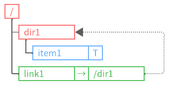
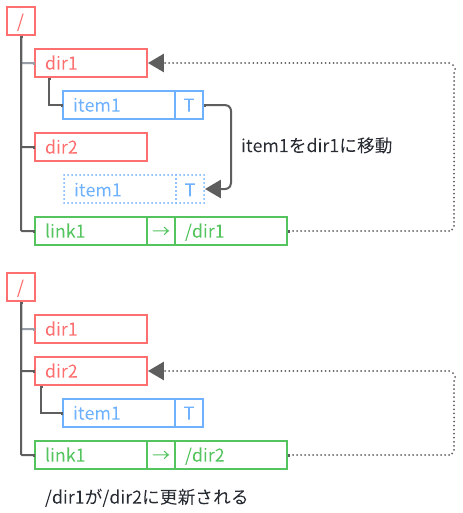
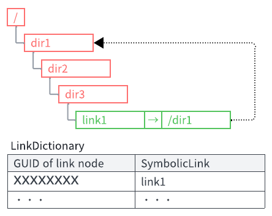
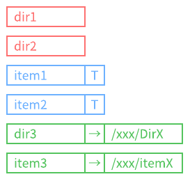
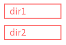
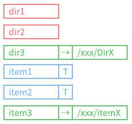

---
title: "HOMEPAGE"
_layout: landing
---

  
Language: Japanese

  <ul>
    <li><a href="index.md">English</a></li>
    <li><a href="index.ja.md">Japanese</a></li>
  </ul>

# **VirtualStorageLibrary へようこそ!**

---

## **.NET開発者の為のツリー構造コレクション**

`VirtualStorageLibrary`は、完全にオンメモリで動作し、**ツリー構造コレクション**を提供する.NETライブラリです。  
このライブラリは、**データの階層的な構造を管理するための基盤**を提供し、**ユーザー定義型**`T`を内包するアイテム、ディレクトリ、シンボリックリンクをサポートします。  
このライブラリは**ファイルシステムではありません。**   
従来のファイルシステムの概念を参考にしつつ、より柔軟で使いやすいツリー構造を実現するために**ゼロから再設計**しました。  
このライブラリは、ユーザーが**パスの指定による**ノードの参照、探索、操作を **直感的** に行えるようにすることを目的としています。  

## 主な機能

### 柔軟なツリー構造

親子関係に基づく階層的なデータ構造を提供し、柔軟なノード管理が可能です。

### 多様なノードのサポート

ユーザー定義型`T`を含むアイテム、ディレクトリ、シンボリックリンクをサポートします。

アイテムはジェネリック型であり、`T`はアイテムが内包するユーザー定義型`T`を表しています。

リンクは一般的なシンボリックリンクに似た機能を備えており、リンク先のターゲットパスを内包しています。

### パスによる直感的なノード操作

パスを指定することでノードの参照、探索、追加、削除、変名、コピーおよび、移動が容易に行え、使いやすいAPIを提供します。

- フルパス指定  
  "/dir1/item1"

- 相対指定  
  "item1"

- 相対指定(ドット)  
  "./item"

- 相対指定(ドットドット)  
  "../item"

### リンク管理

一般のファイルシステムと同じようにシンボリックリンクを備えています。  
存在していないノードをターゲットパスとして指定しシンボリックリンクを作成する事も可能です。また、ターゲーットパスとして`null`を指定する事も可能です。この様なシンボリックリンクを`VirtualStorageLibrary`では`nullリンク`と呼んでいます。  
パス探索時、リンク解決が指定された状態でターゲットパスが存在していない場合は例外がスローされます。また、`nullリンク`の場合は、リンク解決が指定されていても解決は行いません(例外はスローされません)。

リンク辞書を使ったシンボリックリンクの変更を管理し、ターゲットパスの変更を追跡します。

### 循環参照防止

シンボリックリンクを含んだパスを探索時、ディレクトリを循環参照するような構造を検出した場合、例外をスローします。`VirtualStorageLibrary`では、循環参照チェック用辞書にパスを解決した際のリンク情報のみを記録していく方式を採用しています。  
循環参照するリンクを作成する事は可能です。

パス探索時、1回目のパス解決で辞書にリンク情報を登録します。2回目のパス解決で辞書にリンク情報があるか確認し、あれば循環参照と判断します。

### 柔軟なノードリストの取得

ディレクトリ内のノードのリストを取得する際、指定されたノードタイプでフィルタ、グルーピングし、指定されたプロパティでソートした結果を取得することができます。

- デフォルト: ノードタイプでグルーピングされ、名前でソートされます。
  
  

- フィルタリング: 特定のノードタイプだけを取得する事ができます。
  
  

- ソート: 特定のプロパティでソートし取得する事ができます。
  
  

## ドキュメント

このライブラリの詳細な使用方法やリファレンスについては、以下のドキュメントを参照してください。

- [Introduction](introduction.md)  
  ライブラリの概要と設計思想を説明しています。  
  どのような目的で開発されたのか、その基本的な機能と特徴を紹介します。  
  新しいユーザーがライブラリの全体像を把握するための入門ガイドです。  

- [Getting Started](getting-started.md)  
  ライブラリを使い始めるためのステップバイステップガイドです。  
  インストール方法から初期設定、簡単なサンプルコードまで、ライブラリを導入するために必要な基本的な手順を説明します。  

- [APIリファレンス](xref:AkiraNetwork.VirtualStorageLibrary)  
  ライブラリに含まれる全てのクラス、メソッド、およびプロパティについての詳細な情報を提供しています。  
  各メンバーの使用方法やパラメータについての説明が含まれており、ライブラリの具体的な使い方を確認するのに役立ちます。  

- チュートリアル (執筆予定)  
  実際のユースケースに基づいた詳細な使用例を提供し、ライブラリの応用的な使い方を学ぶためのガイドです。今後追加予定です。  

- [ライセンス](licenses.md)  
  このライブラリのライセンスと使用しているライブラリ、ツール、CSS等のライセンスについて情報を提供しています。

## リポジトリ

[VirtualStorageLibrary GitHub](https://github.com/AkiraNetwork/VirtualStorageLibrary)
