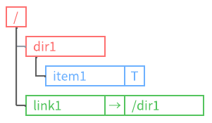
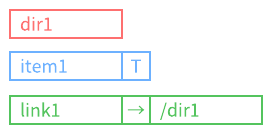

---
_layout: landing
---

Under Construction. This Readme is a work in progress. Once it's completed, an English version will be provided.

---

  
Language: English

  <ul>
    <li><a href="index.md">English</a></li>
    <li><a href="index.ja.md">Japanese</a></li>
  </ul>

# **VirtualStorageLibrary へようこそ!**

---

## **.NET開発者の為のツリー構造コレクション**

VirtualStorageLibrary`は、完全にオンメモリで動作し、**ツリー構造コレクション**を提供する.NETライブラリです。  
このライブラリは、**データの階層的な構造を管理するための基盤**を提供し、**ユーザー定義型**を内包するアイテム、ディレクトリ、シンボリックリンクをサポートします。  
このライブラリは**ファイルシステムではありません。**   
従来のファイルシステムの概念を参考にしつつ、より柔軟で使いやすいツリー構造を実現するために**ゼロから再設計**しました。  
このライブラリは、ユーザーが**パスの指定による**ノードの参照、探索、操作を **直感的** に行えるようにすることを目的としています。  

## 主な機能

#### 柔軟なツリー構造

親子関係に基づく階層的なデータ構造を提供し、柔軟なノード管理が可能です。

#### 多様なノードのサポート

ユーザー定義型`T`を含むアイテム、ディレクトリ、シンボリックリンクをサポートします。

アイテムはジェネリック型であり、`T`はアイテムが内包するユーザー定義型`T`を表しています。

リンクは一般的なシンボリックリンクに似た機能を備えており、リンク先のターゲットパスを内包しています。

#### パスによる直感的なノード操作

パスを指定することでノードの参照、探索、追加、削除、変名、コピーおよび、移動が容易に行え、使いやすいAPIを提供します。

- フルパス指定  
  "/dir1/item1"

- 相対指定  
  "item1"

- 相対指定(ドット)  
  "./item"

- 相対指定(ドットドット)  
  "../item"

#### リンク管理

リンク辞書を使ったシンボリックリンクの変更を管理し、ターゲットパスの変更を追跡します。

#### 循環参照防止

シンボリックリンクを含んだパスを解決時、ディレクトリを循環参照するような構造を検出した場合、例外をスローします。

#### 柔軟なノードリストの取得

ディレクトリ内のノードのリストを取得する際、指定されたノードタイプでフィルタ、グルーピングし、指定された属性でソートした結果を取得します。
