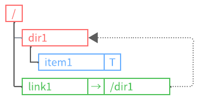

  
Language: English

  <ul>
    <li><a href="index.md">English</a></li>
    <li><a href="index.ja.md">Japanese</a></li>
  </ul>

# **Welcome to VirtualStorageLibrary!**

---

## **Tree Structure Collection for .NET Developers**

`VirtualStorageLibrary` is a .NET library that operates entirely in memory and provides a
**tree structure collection**.  
This library offers a **foundation for managing hierarchical data structures**,
supporting items, directories, and symbolic links that encapsulate user-defined types `T`.  
This library is **not a file system**.  
Inspired by traditional file systems, it has been **redesigned from scratch** to offer a
more flexible and user-friendly tree structure.  
The library aims to enable users to **intuitively** reference, traverse, and manipulate
nodes via **path specification**.

## Main Features

### Flexible Tree Structure

Provides a hierarchical data structure based on parent-child relationships, enabling
flexible node management.

### Support for Various Node Types

Supports items, directories, and symbolic links containing user-defined types `T`.

Items are of a generic type, with `T` representing the user-defined type encapsulated by
the item.

Links function similarly to traditional symbolic links and contain the target path they
point to.

### Intuitive Node Operations via Paths

Allows easy referencing, traversing, adding, deleting, renaming, copying, and moving of
nodes through path specification, offering a user-friendly API.

- Full Path Specification  
  "/dir1/item1"

- Relative Path Specification  
  "item1"

- Relative Path (Dot)  
  "./item"

- Relative Path (Dot Dot)  
  "../item"

### Link Management

Just like general file systems, symbolic links are supported.  
You can create symbolic links by specifying a target path for nodes that do not exist.
It is also possible to specify `null` as the target path, creating what
`VirtualStorageLibrary` refers to as `null links`.  
If link resolution is specified during path traversal and the target path does not exist,
an exception will be thrown. In the case of a `null link`, even if link resolution is
specified, it will not resolve (no exception will be thrown).

Manages changes to symbolic links using a link dictionary, tracking changes to the target path.

### Prevention of Circular References

When traversing paths that include symbolic links, if a structure that would result in
circular directory references is detected, an exception will be thrown.  
`VirtualStorageLibrary` employs a method of recording only the link information at the
time of path resolution in a circular reference check dictionary.  
It is possible to create links that would result in circular references.

When traversing paths, the link information is registered in the dictionary during the first path resolution. During the second path resolution, the dictionary is checked for the link information, and if it is found, it is considered a circular reference.

### Flexible Node List Retrieval

When retrieving a list of nodes within a directory, you can filter and group by the
specified node type and retrieve the sorted results based on the specified properties.

- Default: Nodes are grouped by node type and sorted by name.
  
  

- Filtering: You can retrieve only specific node types.
  
  

- Sorting: You can retrieve nodes sorted by specific properties.
  
  

## Documentation

For detailed usage and reference information about this library, please refer to the
following documents.

- [Introduction](introduction.md)  
  An overview and design philosophy of the library.  
  It explains the purpose behind its development, introduces its basic functions and
  features, and serves as an introductory guide for new users to understand the library
  as a whole.  

- [Getting Started](getting-started.md)  
  A step-by-step guide to getting started with the library.  
  It explains the basic steps necessary to install, configure, and use the library, from
  installation to sample code.  

- [API Reference](xref:AkiraNetwork.VirtualStorageLibrary)  
  Detailed information about all classes, methods, and properties included in the
  library.  
  It includes explanations of how to use each member and its parameters, helping you
  understand the specific usage of the library.  

- Tutorial (Coming Soon)  
  A guide based on real-world use cases, providing detailed examples to help you learn
  how to apply the library in practice. This will be added soon.  

- [Licenses](licenses.md)  
  Information about the license for this library and the licenses for the libraries,
  tools, CSS, etc., used.
